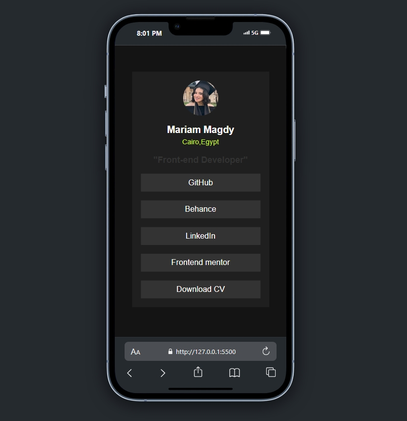
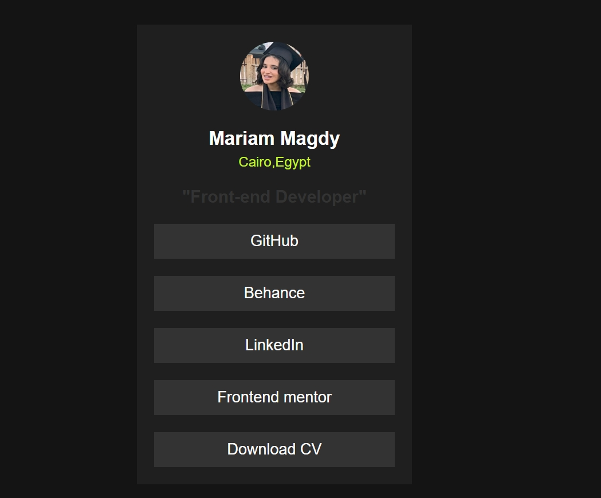

# Frontend Mentor - Social links profile solution

This is a solution to the [Social links profile challenge on Frontend Mentor](https://www.frontendmentor.io/challenges/social-links-profile-UG32l9m6dQ). Frontend Mentor challenges help you improve your coding skills by building realistic projects.

## Table of contents

- [Overview](#overview)
  - [The challenge](#the-challenge)
  - [Screenshot](#screenshot)
  - [Links](#links)
- [My process](#my-process)
  - [Built with](#built-with)
  - [What I learned](#what-i-learned)
  - [Continued development](#continued-development)
  - [Useful resources](#useful-resources)
- [Author](#author)

## Overview

### The challenge

Users should be able to:

- See hover and focus states for all interactive elements on the page

### Screenshot





### Links

- Solution URL: [Frontend Mentor Solution](https://www.frontendmentor.io/solutions/social-links-profile-EzMXpZDual)
- Live Site URL: [Live Demo]( https://maryammagdy123.github.io/Social-links-profile/)


## My process

### Built with

- Semantic HTML5 markup
- CSS custom properties (variables)
- Flexbox
- Mobile-first workflow

### What I learned

In this project, I practiced:

- Using `flex-direction: column` to arrange items vertically.
- How to center a card using `margin: auto`.
- Styling buttons with hover effects.
- Implementing responsive design with a simple media query.

Example of the button hover:

```css
.social-card .btn {
    display: block;
    width: 100%;
    padding: 10px 20px;
    background-color: var(--Grey-700);
    border: none;
    border-radius: 4px;
    transition: all 0.1s ease;
    text-decoration: none;
    font-size: 18px;
    font-weight: 500;
    color: var(--White);
}

.social-card .btn:hover {
    background-color: var(--Green);
    color: var(--Grey-800);
}
}
```

### Continued development

In future projects, I want to:

- Improve my responsive design skills further.
- Explore more accessibility best practices.
- Work more with advanced layout techniques like CSS Grid.

### Useful resources

- [MDN Web Docs - Flexbox](https://developer.mozilla.org/en-US/docs/Web/CSS/flexbox) - Helped me understand flexbox behavior better.
- [CSS Variables](https://developer.mozilla.org/en-US/docs/Web/CSS/Using_CSS_custom_properties) - For better theming and easier style management.

## Author

- Frontend Mentor - [@maryammagdy123](https://www.frontendmentor.io/profile/maryammagdy123)
- LinkedIn - [Mariam Magdy](https://www.linkedin.com/in/mariam-magdy-1aa578216/)
